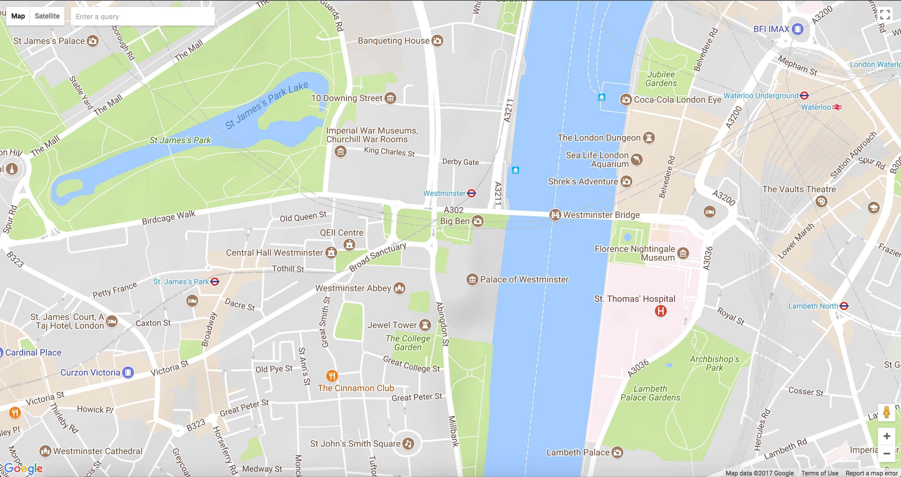
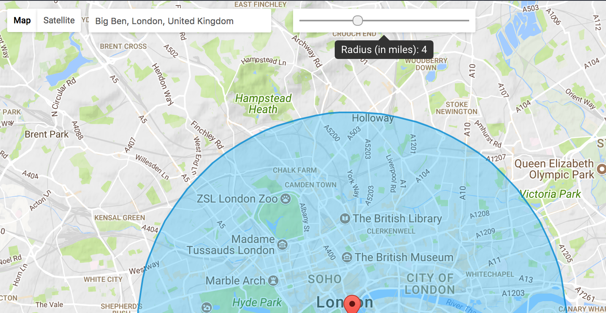
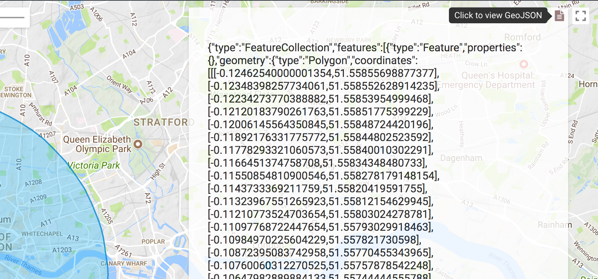

# geojson
An application that uses Google Maps to draw a marker and a circle around all matching locations for an address/place and to convert the polygons representing the circles into GeoJSON data.

## Getting started
1. Download/clone the repo to your system. 
2. Open index.html.

## Screenshots
### 1. Home
Type in a location in the address input to search for places. 

### 2. Search result - Adjust circle radius
The radius slider will allow you to adjust the radius of the drawn circle anywhere from 1 to 10 miles. 

### 3. Search result - View GeoJSON
The GeoJSON data for all polygons that are currently rendered on the map is available. Copy and paste this data into a service like [geojson.io](http://geojson.io/) to view the polygon(s) it represents.

## Issues
In case the map doesn't load on your machine, try clearing the cache and refreshing your browser window. 

